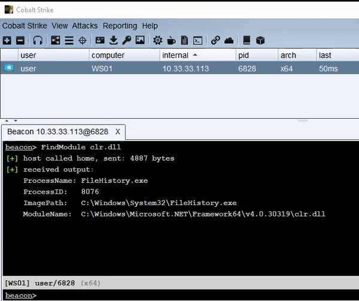

# inject-assembly - Execute .NET in an Existing Process
This tool is an alternative to traditional fork and run execution for Cobalt Strike. The loader can be injected into any process, including the current Beacon. Long-running assemblies will continue to run and send output back to the Beacon, similar to the behavior of execute-assembly.

<p align="center">
  
</p>

There are two components of inject-assembly:
1. **BOF initializer**: A small program responsible for injecting the assembly loader into a remote process with any arguments passed. It uses BeaconInjectProcess to perform the injection, meaning this behavior can be customized in a Malleable C2 profile or with process injection BOFs (as of version 4.5).

2. **PIC assembly loader**: The bulk of the project. The loader will initialize the .NET runtime, load the provided assembly, and execute the assembly. The loader will create a new AppDomain in the target process so that the loaded assembly can be totally unloaded when execution is complete.

Communication between the remote process and Beacon occurs through a named pipe. The Aggressor script generates a pipe name and then passes it to the BOF initializer.

## Notable Features
* Patches Environment.Exit() to prevent the remote process from exiting.
* .NET assembly header stomping (MZ bytes, e_lfanew, DOS Header, Rich Text, PE Header).
* Random pipe name generation based on [SourcePoint](https://github.com/Tylous/SourcePoint).
* No blocking of the Beacon, even if the assembly is loaded into the current process.

## Usage
[Download](https://github.com/kyleavery/inject-assembly/releases) and load the inject-assembly.cna Aggressor script into Cobalt Strike. You can then execute assemblies using the following command:
```
inject-assembly pid assembly [args...]
```
Specify 0 as the PID to execute in the current Beacon process.

It is recommended to use another tool, like [FindObjects-BOF](https://github.com/outflanknl/FindObjects-BOF), to locate a process that already loads the .NET runtime, but this is not a requirement for inject-assembly to function.

## Warnings
* Currently only supports x64 remote processes.
* There are several checks throughout the program to reduce the likelihood of crashing the remote process, but it could still happen.
* The default Cobalt Strike process injection may get you caught. Consider a custom injection BOF or UDRL IAT hook.
* Some assemblies rely on Environment.Exit() to finish executing. This will prevent the loader's cleanup phase from occurring, but you can still disconnect the named pipe using `jobkill`.
* Uncomment lines 3 or 4 of scmain.c to enable error or verbose modes, respectively. These are disabled by default to reduce the shellcode size.

## References
This project would not have been possible without the following projects:
* CLR-related definitions and implementation - [https://github.com/TheWover/donut](https://github.com/TheWover/donut)
* Beacon job interface and project structure - [https://github.com/SecIdiot/netntlm](https://github.com/SolomonSklash/netntlm)

Other features and inspiration were taken from the following resources:
* [https://github.com/med0x2e/ExecuteAssembly](https://github.com/med0x2e/ExecuteAssembly)
* [https://github.com/anthemtotheego/InlineExecute-Assembly](https://github.com/anthemtotheego/InlineExecute-Assembly)
* [https://www.mdsec.co.uk/2020/08/massaging-your-clr-preventing-environment-exit-in-in-process-net-assemblies](https://www.mdsec.co.uk/2020/08/massaging-your-clr-preventing-environment-exit-in-in-process-net-assemblies)
